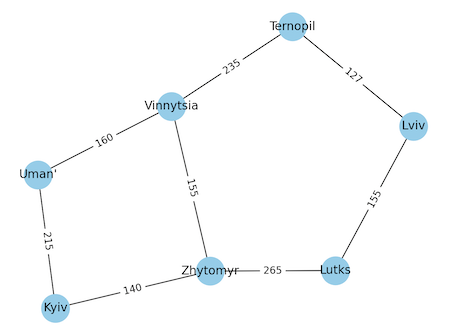
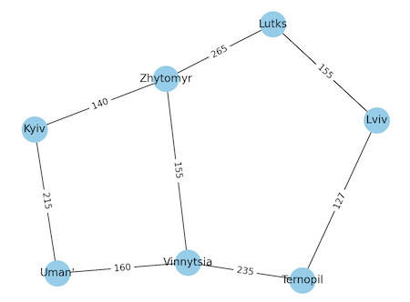

# Домашнє завдання 6

Перед виконанням програм встановіть залежності, якщо треба.

```
pip install -r requirements.txt
```

## Залежності

-   matplotlib
-   networkx

## Завдання 1

Створіть граф за допомогою бібліотеки networkX для моделювання певної реальної мережі (наприклад, транспортної мережі міста, соціальної мережі, інтернет-топології).

Візуалізуйте створений граф, проведіть аналіз основних характеристик (наприклад, кількість вершин та ребер, ступінь вершин).

### Виконання

За основу моделі графа був взятий словник з відстанями між містами України.

```
{
  "Kyiv": ["Zhytomyr", "Uman'"],
  "Uman'": ["Kyiv", "Vinnytsia"],
  "Vinnytsia": ["Uman'", "Zhytomyr", "Ternopil"],
  "Zhytomyr": ["Kyiv", "Vinnytsia", "Lutks"],
  "Ternopil": ["Vinnytsia", "Lviv"],
  "Lutks": ["Zhytomyr", "Lviv"],
  "Lviv": ["Lutks", "Ternopil"],
}
```

Домашнє завдання виконано у файлі task_1.py.

### Приклад запуску програми

```
python task_1.py
```

### Приклад роботи програми

Запуск програми

```
python task_1.py
```

Результат виконання

```
Основні характеристики:
----------------------------
Кількість вузлів: 7
Кількість ребер: 8
Ступінь вершин:
Kyiv: 2, Zhytomyr: 3, Uman': 2, Vinnytsia: 3, Lutks: 2, Ternopil: 2, Lviv: 2
Граф є сполученим

Метрик центральності вузлів:
----------------------------
Ступінь центральності:
Kyiv: 0.33, Zhytomyr: 0.50, Uman': 0.33, Vinnytsia: 0.50, Lutks: 0.33, Ternopil: 0.33, Lviv: 0.33
Ступінь близькості:
Kyiv: 0.50, Zhytomyr: 0.67, Uman': 0.50, Vinnytsia: 0.67, Lutks: 0.55, Ternopil: 0.55, Lviv: 0.50
Ступінь посередництва:
Kyiv: 0.07, Zhytomyr: 0.33, Uman': 0.07, Vinnytsia: 0.33, Lutks: 0.13, Ternopil: 0.13, Lviv: 0.07
```

### Візуалізація графа



## Завдання 2

Напишіть програму, яка використовує алгоритми DFS і BFS для знаходження шляхів у графі, який було розроблено у першому завданні.

Далі порівняйте результати виконання обох алгоритмів для цього графа, висвітлить різницю в отриманих шляхах. Поясніть, чому шляхи для алгоритмів саме такі.

### Виконання

Домашнє завдання виконано у файлі task_2.py.

### Приклад роботи програми

Запуск програми

```
python task_2.py
```

Результат виконання

```
Початок руху з міста Kyiv
Пошук у глибину (DFS):
{'Zhytomyr', 'Vinnytsia', 'Ternopil', 'Lutks', 'Kyiv', "Uman'", 'Lviv'}

Пошук у ширину (BFS):
{'Zhytomyr', 'Vinnytsia', 'Lutks', 'Ternopil', 'Kyiv', "Uman'", 'Lviv'}
```

## Завдання 3

Реалізуйте алгоритм Дейкстри для знаходження найкоротшого шляху в розробленому графі: додайте у граф ваги до ребер та знайдіть найкоротший шлях між всіма вершинами графа.

### Виконання

Домашнє завдання виконано у файлі task_3.py.

За основу моделі графа був взятий словник з відстанями між містами України та вагами до ребер.

```
{
  "Kyiv": {"Zhytomyr": 140, "Uman'": 215},
  "Uman'": {"Kyiv": 215, "Vinnytsia": 160},
  "Vinnytsia": {"Uman'": 160, "Zhytomyr": 155, "Ternopil": 235},
  "Zhytomyr": {"Kyiv": 140, "Vinnytsia": 155, "Lutks": 265},
  "Ternopil": {"Vinnytsia": 235, "Lviv": 127},
  "Lutks": {"Zhytomyr": 265, "Lviv": 155},
  "Lviv": {"Lutks": 155, "Ternopil": 127},
}
```

### Приклад роботи програми

Запуск програми

```
python task_3.py
```

Результат виконання

```
Початок руху з міста Kyiv
Найкоротші шляхи між всіма вершинами графа:
Kyiv: 0, Uman': 215, Vinnytsia: 295, Zhytomyr: 140, Ternopil: 530, Lutks: 405, Lviv: 560
```

### Візуалізація графа з вагами до ребер


